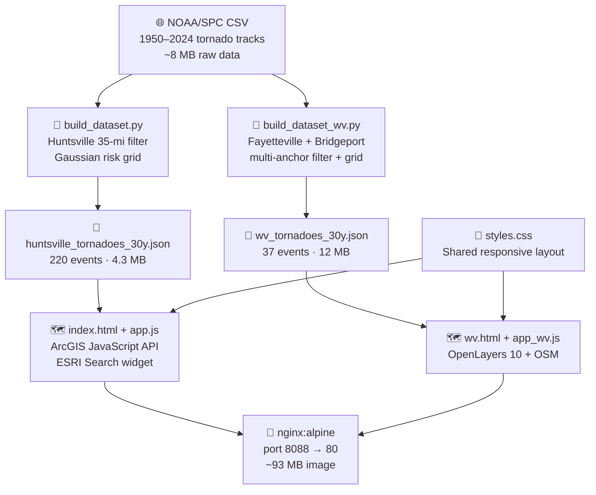
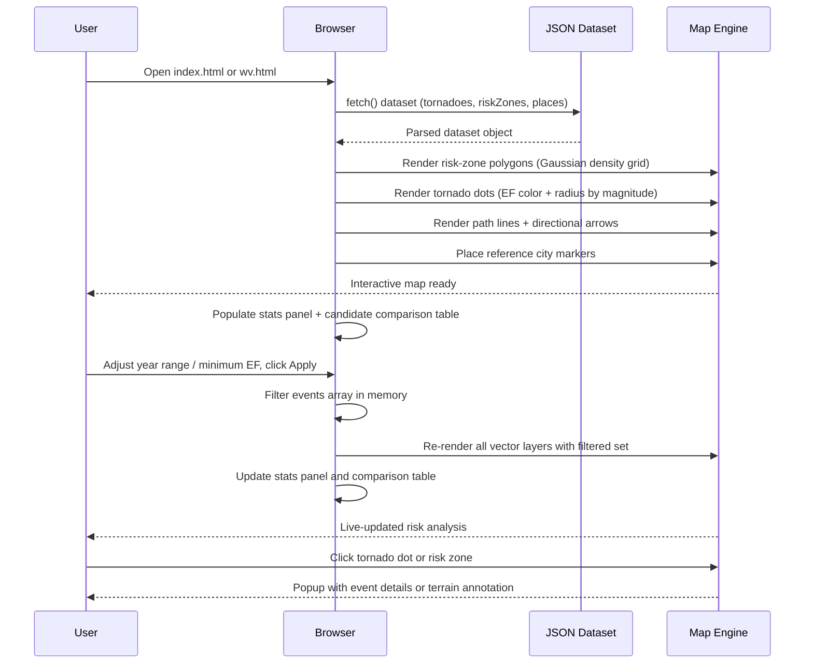
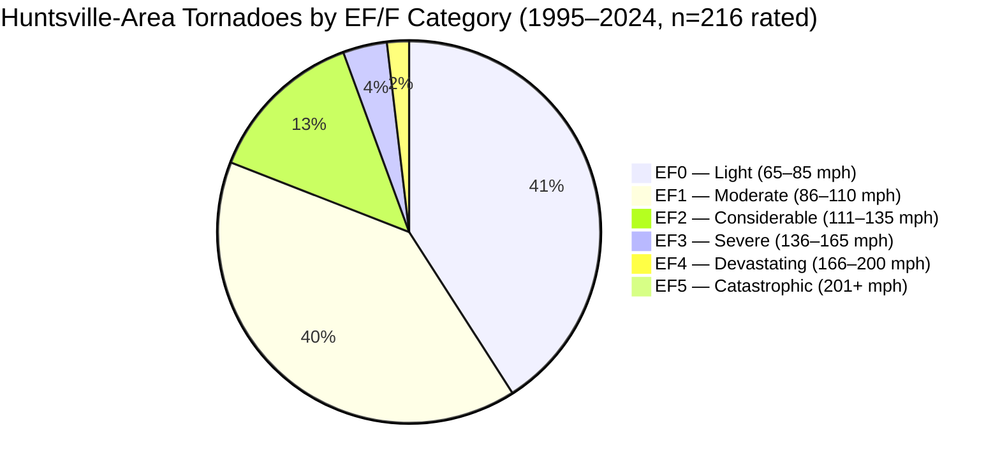
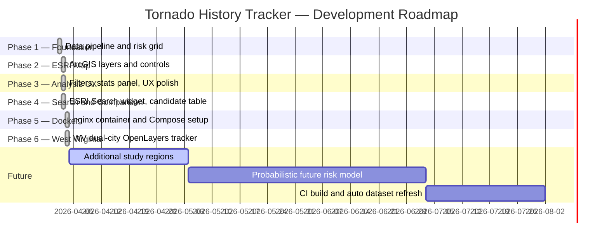
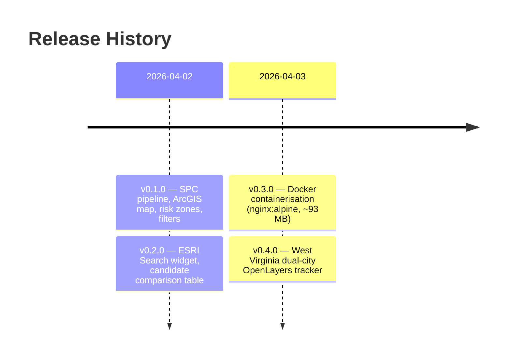

<div align="center">
  <h1>🌪️ Tornado History Tracker</h1>
  <p><em>Interactive multi-region web maps for historical tornado risk analysis — compare candidate locations using 30 years of NOAA/SPC data.</em></p>
</div>

<div align="center">

[](LICENSE)
[](https://github.com/hkevin01/tornado-history-tracker/stargazers)
[](https://github.com/hkevin01/tornado-history-tracker/network)
[](https://github.com/hkevin01/tornado-history-tracker/commits/main)
[](https://github.com/hkevin01/tornado-history-tracker)
[](https://python.org)
[](https://nginx.org)
[](https://docker.com)

</div>

---

## Table of Contents

- [Overview](#overview)
- [Key Features](#key-features)
- [Architecture](#architecture)
- [Usage Flow](#usage-flow)
- [Tornado Distribution](#tornado-distribution)
- [Technology Stack](#technology-stack)
- [Setup & Installation](#setup--installation)
- [Docker Deployment](#docker-deployment)
- [Map Pages](#map-pages)
  - [Huntsville, AL](#-huntsville-al--indexhtml)
  - [West Virginia](#-west-virginia--wvhtml)
- [Roadmap](#roadmap)
- [Release History](#release-history)
- [Project Layout](#project-layout)
- [Method Notes](#method-notes)
- [Safety Note](#safety-note)
- [Contributing](#contributing)
- [License](#license)

---

## Overview

Tornado History Tracker is a fully static, dual-map platform for historical tornado risk analysis. It ingests raw NOAA/SPC tornado track records dating back to 1950, filters to the most recent 30 years, and renders an interactive layered risk map for each study region. Two independent map views are provided:

- **Huntsville, AL** — Dixie Alley exposure (220 events, 1995–2024) with ArcGIS/ESRI mapping; compares Chapman Mountain and Hampton Cove.
- **Fayetteville & Bridgeport, WV** — Appalachian terrain protection context (37 events, 1995–2024) with OpenLayers + OpenStreetMap; compares both cities directly.

The tool targets relocation researchers, real-estate analysts, emergency managers, and homebuyers who need an honest, data-driven picture of long-term tornado exposure for specific candidate locations — not just a generalized regional assessment.

> [!IMPORTANT]
> This tool is for historical analysis and planning support **only**. It does not predict future tornado occurrence and must not replace official NWS/NOAA weather guidance or local emergency management advice.

<p align="right">(<a href="#top">back to top ↑</a>)</p>

---

## Key Features

| Icon | Feature | Description | Impact | Status |
|------|---------|-------------|--------|--------|
| 🗺️ | Dual-Region Risk Maps | Independent ArcGIS (AL) and OpenLayers (WV) maps | Core | ✅ Stable |
| 🎨 | EF/F Category Encoding | Tornado dots and path arrows color-coded by Enhanced Fujita scale | Core | ✅ Stable |
| 🟥 | Risk-Zone Grid | Gaussian-kernel density + magnitude grid; 5-level danger classification | Core | ✅ Stable |
| 🔍 | ESRI Search Widget | Address/ZIP geocoding for any location in the Huntsville study area | UX | ✅ Stable |
| 📊 | Candidate Comparison | Side-by-side ranked table: events, EF2+, injuries, fatalities, risk score | Analysis | ✅ Stable |
| 🎛️ | Dynamic Filters | Year range + minimum EF category; comparison table updates live on apply | UX | ✅ Stable |
| 📍 | Terrain Annotations | Every risk-zone popup explains the geographic reason for its danger level | Context | ✅ Stable |
| 🐳 | Docker Deployment | Single-command start via nginx:alpine; ~93 MB image | DevOps | ✅ Stable |
| 🧪 | Unit Test Suite | Happy-path, edge-case, and error-handling tests for both pipelines | QA | ✅ Stable |

**Highlights:**

- **Track-interpolated detection**: events are sampled every 1 mile along track and matched against multi-anchor city radii — captures tornadoes that pass *through* a study area even when start/end points are just outside it.
- **Terrain-aware region annotations**: each WV risk-zone popup cites valley corridors, plateau elevations, and documented storm approach vectors to explain *why* that sub-region carries its assessed risk level.
- **Cross-region calibration**: the WV stats panel compares both WV cities against the Huntsville 220-event baseline, giving users a proportional sense of the Appalachian protection factor.
- **Zero runtime dependencies**: fully static — no backend, no API keys at runtime. All data is pre-processed and shipped as JSON alongside the HTML.

<p align="right">(<a href="#top">back to top ↑</a>)</p>

---

## Architecture



| Component | Responsibility |
|-----------|---------------|
| `build_dataset.py` | Loads SPC CSV; filters to 35-mile Huntsville radius using track interpolation; builds Gaussian risk grid; emits JSON |
| `build_dataset_wv.py` | Same pipeline for two WV cities; Fayetteville uses 4 anchors (city + Oak Hill + Ansted + Gauley Bridge) |
| `app.js` | ArcGIS FeatureLayer rendering, ESRI Search widget, candidate comparison table, dynamic filter wiring |
| `app_wv.js` | OpenLayers Vector layers, popup overlays, directional path arrow rendering, WV candidate comparison |
| `styles.css` | Shared panel layout, EF color gradient strips, legend cards, comparison table badges |
| `nginx.conf` | Static file serving, correct JSON MIME types, `no-store` cache header for dataset endpoints |

<p align="right">(<a href="#top">back to top ↑</a>)</p>

---

## Usage Flow



**Step-by-step:**

1. Run the data build script(s) once to produce the JSON datasets.
2. Serve the project root from any static HTTP server.
3. Open `http://localhost:8088` for the Huntsville view or `/wv.html` for the WV view.
4. Use the sidebar controls to adjust the year window and minimum EF threshold.
5. Click **Apply Filters** — the map, stats panel, and comparison table all update.
6. Click any tornado marker or risk-zone cell for a detail popup.

<p align="right">(<a href="#top">back to top ↑</a>)</p>

---

## Tornado Distribution

Distribution of all **220 tornado events** in the Huntsville, AL 30-year study area (1995–2024):



| Category | Wind Speed | Events | % of Total | Notes |
|----------|-----------|--------|------------|-------|
| EF0 | 65–85 mph | 88 | 40.0% | Most frequent; downed trees, minor roof damage |
| EF1 | 86–110 mph | 86 | 39.1% | Roof peeling, overturned mobile homes |
| EF2 | 111–135 mph | 29 | 13.2% | Substantial structural damage |
| EF3 | 136–165 mph | 8 | 3.6% | Wall collapse; fatalities likely |
| EF4 | 166–200 mph | 4 | 1.8% | Leveled well-built homes |
| EF5 | 201+ mph | 1 | 0.5% | April 27, 2011 outbreak event |
| Unknown | — | 4 | 1.8% | SPC records with no rating assigned |

> [!NOTE]
> The WV study areas have dramatically fewer events over the same 30-year window: **Fayetteville 17 events**, **Bridgeport 20 events** (37 unique total). This ~6× reduction reflects genuine Appalachian terrain suppression of tornado formation and track continuation — not a data gap.

<p align="right">(<a href="#top">back to top ↑</a>)</p>

---

## Technology Stack

| Technology | Purpose | Why Chosen | Alternatives Considered |
|------------|---------|------------|------------------------|
| Python 3.11+ | Data pipeline: CSV → filter → risk grid → JSON | Standard library only (`csv`, `math`, `json`) — zero install dependencies | pandas (overhead), R (non-standard env) |
| ArcGIS JavaScript API 4.x | Huntsville map + ESRI Search geocoding | Production ESRI Search widget; no API key for OSM basemap; mature FeatureLayer API | Leaflet (no built-in geocoder), Mapbox (requires paid key) |
| OpenLayers 10.x | WV map rendering + popup overlays | CDN-delivered, no config, excellent vector layer performance; no ESRI account required | Leaflet (less capable vector styling), MapLibre (heavier bundle) |
| OpenStreetMap | Basemap tiles for WV view | Free, no API key, globally maintained, permissive license | ESRI World Imagery (requires account), Stadia Maps (requires key) |
| nginx:alpine | Static file server in Docker | Minimal image (~5 MB base), correct MIME handling, production-tested, cache-control headers | Apache httpd (heavier), Caddy (less standard for static-only) |
| Docker Compose | One-command local deployment | Port and volume config in version control; standardized dev and prod experience | Manual `docker run` (no config as code) |

<p align="right">(<a href="#top">back to top ↑</a>)</p>

---

## Setup & Installation

### Prerequisites

- Python 3.11 or later
- A modern web browser (Chrome, Firefox, Edge, Safari)
- Docker + Docker Compose *(optional — for containerised deployment only)*

### 1. Clone the Repository

```bash
git clone https://github.com/hkevin01/tornado-history-tracker.git
cd tornado-history-tracker
```

### 2. Build the Processed Datasets

```bash
# Huntsville, AL — outputs data/processed/huntsville_tornadoes_30y.json
python3 scripts/build_dataset.py

# West Virginia dual-city — outputs data/processed/wv_tornadoes_30y.json
python3 scripts/build_dataset_wv.py
```

> [!TIP]
> Both scripts read from `data/raw/spc_1950_2024_actual_tornadoes.csv` which is already included in the repository. Re-run the scripts any time you replace the raw CSV with a newer SPC export.

### 3. Serve Locally

```bash
python3 -m http.server 8088
```

Then open in your browser:

| Page | URL |
|------|-----|
| Huntsville, AL | `http://localhost:8088` |
| West Virginia | `http://localhost:8088/wv.html` |

### 4. Run Tests

```bash
python3 -m unittest tests/test_build_dataset.py -v
python3 -m unittest tests/test_build_dataset_wv.py -v
```

Expected output: all tests `ok`.

<p align="right">(<a href="#top">back to top ↑</a>)</p>

---

## Docker Deployment

```bash
# One-command start (recommended)
docker compose -f docker/docker-compose.yml up -d

# Or build and run manually
docker build -f docker/Dockerfile -t tornado-history-tracker:latest .
docker run -d -p 8088:80 --name tornado-tracker tornado-history-tracker:latest

# Stop
docker compose -f docker/docker-compose.yml down
```

Press <kbd>Ctrl</kbd>+<kbd>C</kbd> to stop a foreground container. Use `docker stop tornado-tracker` for a background container.

| Detail | Value |
|--------|-------|
| Base image | `nginx:alpine` |
| Final image size | ~93 MB |
| Host port | `8088` |
| Container port | `80` |
| Health check | `curl -sf http://localhost/` every 15 s |
| Dataset cache | `Cache-Control: no-store` (always fresh) |
| Static asset cache | `public, max-age=3600` |

> [!WARNING]
> The Docker image copies **processed JSON only** — not the raw CSV or build scripts. Rebuild the JSON datasets on the host *before* rebuilding the Docker image if you update the source data.

<p align="right">(<a href="#top">back to top ↑</a>)</p>

---

## Map Pages

### 🏔️ Huntsville, AL — `index.html`

Huntsville sits in the Tennessee Valley corridor of Dixie Alley, one of the highest per-capita tornado-risk regions in the US. The April 27, 2011 outbreak produced an EF5 event that affected the region and is captured in the dataset.

The map compares two candidate locations within the study area:

| Location | Lat/Lon | Terrain Context |
|----------|---------|----------------|
| Chapman Mountain | 34.85, −86.64 | Northwest of downtown; elevated ridge position above the valley floor |
| Hampton Cove | 34.79, −86.43 | Northeast; valley floor terrain with lower relative elevation |

Powered by the **ArcGIS JavaScript API** with the ESRI Search widget for live address and ZIP geocoding.

### 🌿 West Virginia — `wv.html`

The WV page covers two cities in dramatically lower-risk Appalachian terrain. The Appalachian topography — deep gorges, high plateaus, cross-oriented ridges — suppresses tornado formation and disrupts track continuation at a level with no equivalent in the Tennessee Valley or Ohio plains.

| City | Lat/Lon | Events (30 yr) | Terrain Context |
|------|---------|----------------|----------------|
| Fayetteville, WV | 38.0512, −81.1070 | 17 | New River Gorge plateau; 1,600–1,900 ft with 900–1,200 ft gorge cuts |
| Bridgeport, WV | 39.2965, −80.2513 | 20 | West Fork valley; 900–1,100 ft; most open terrain in North-Central WV |

Powered by **OpenLayers 10 + OpenStreetMap** — no ESRI account or API key required.

<details>
<summary>📍 All Reference Places Shown on the WV Map</summary>

| Place | Role |
|-------|------|
| Fayetteville, WV | Primary candidate — southern study area |
| Bridgeport, WV | Primary candidate — northern study area |
| Clarksburg, WV | Bridgeport metro anchor (secondary detection point) |
| Oak Hill, WV | Fayetteville secondary anchor (6 mi south) |
| Summersville, WV | Gauley / Nicholas County region reference |
| Weston, WV | Central WV transitional zone reference |

</details>

<p align="right">(<a href="#top">back to top ↑</a>)</p>

---

## Roadmap



| Phase | Goals | Status |
|-------|-------|--------|
| 1 — Foundation | SPC CSV ingestion, 30-year filter, risk grid | ✅ Complete |
| 2 — ESRI Map | ArcGIS layers, EF color encoding, risk zones, popups | ✅ Complete |
| 3 — Analysis UX | Magnitude/year filters, statistics panel | ✅ Complete |
| 4 — Search & Compare | ESRI Search widget, candidate comparison table | ✅ Complete |
| 5 — Docker | nginx:alpine container, Docker Compose, health check | ✅ Complete |
| 6 — West Virginia | OpenLayers WV dual-city tracker, terrain annotations | ✅ Complete |
| Future | Additional regions, probabilistic modeling, CI integration | 🔵 Planned |

<p align="right">(<a href="#top">back to top ↑</a>)</p>

---

## Release History



<details>
<summary>📋 Full Changelog</summary>

### v0.4.0 — 2026-04-03
- Added `wv.html` — West Virginia dual-city tracker (Fayetteville vs Bridgeport) using OpenLayers + OSM.
- Added `src/app_wv.js` with full feature parity: risk zones, tornado dots, path arrows, filters, stats panel, comparison table.
- Added `scripts/build_dataset_wv.py` with multi-anchor city detection and track interpolation.
- Added geographic terrain annotation for all WV risk-zone sub-regions (13 annotated areas total).
- Added `tests/test_build_dataset_wv.py` — unit tests for WV pipeline helpers.
- Added navigation link between Huntsville and WV pages.
- Updated `docs/project_plan.md` Phase 6 gate checklist.

### v0.3.0 — 2026-04-03
- Added `docker/Dockerfile` using `nginx:alpine` to containerise the static web app.
- Added `docker/nginx.conf` with correct MIME types, `no-store` for dataset, and 1-hour CSS/JS cache.
- Added `docker/docker-compose.yml` for one-command startup on port 8088.
- Added `.dockerignore` excluding raw CSV, scripts, tests, and docs (~93 MB final image).

### v0.2.0 — 2026-04-02
- Added ESRI Search widget for ZIP code and address geocoding.
- Added candidate zone comparison table: Chapman Mountain vs Hampton Cove ranked by 5-mile historical exposure.
- Candidate metrics: total nearby events, EF2+ count, injuries, fatalities, risk level, risk score.
- Comparison table updates dynamically when filters are applied.

### v0.1.0 — 2026-04-02
- Created project scaffold with SPC data pipeline and risk-zone grid generator.
- Implemented ESRI ArcGIS web map with tornado point markers and risk-zone polygon layers.
- Added year-range and minimum-magnitude filtering with live statistics panel.

</details>

<p align="right">(<a href="#top">back to top ↑</a>)</p>

---

## Project Layout

```
tornado-history-tracker/
├── index.html                               # Huntsville, AL map app shell
├── wv.html                                  # West Virginia dual-city map shell
├── src/
│   ├── app.js                               # ArcGIS map logic, ESRI Search, comparison
│   ├── app_wv.js                            # OpenLayers WV map logic, layers, comparison
│   └── styles.css                           # Shared responsive layout + legend + table
├── scripts/
│   ├── build_dataset.py                     # Huntsville pipeline: SPC CSV → JSON
│   └── build_dataset_wv.py                  # WV dual-city pipeline: SPC CSV → JSON
├── data/
│   ├── raw/
│   │   └── spc_1950_2024_actual_tornadoes.csv   # Source: NOAA/SPC (~8 MB)
│   └── processed/
│       ├── huntsville_tornadoes_30y.json        # Generated (220 events, 4.3 MB)
│       └── wv_tornadoes_30y.json                # Generated (37 events, 12 MB)
├── tests/
│   ├── test_build_dataset.py                # Unit tests — Huntsville pipeline
│   └── test_build_dataset_wv.py             # Unit tests — WV pipeline
├── docker/
│   ├── Dockerfile                           # nginx:alpine static server
│   ├── nginx.conf                           # MIME types, cache-control headers
│   └── docker-compose.yml                   # Host port 8088 → container port 80
└── docs/
    ├── project_plan.md                      # Phase gates and checklists
    └── implementation_notes.md              # Developer notes
```

<p align="right">(<a href="#top">back to top ↑</a>)</p>

---

## Method Notes

<details>
<summary>🔬 Risk Model Details</summary>

**Spatial Event Detection**
- Events are matched using 1-mile interpolated track sampling — not just start/end point checks.
- Fayetteville uses four geographic anchors (city center + Oak Hill + Ansted + Gauley Bridge) to capture events that enter the metro area from any direction with either endpoint outside the nominal city radius.

**Risk Grid Generation**
- Grid resolution: 0.02° per cell (~1.4 miles).
- Kernel: Gaussian decay with σ = 2.5 miles — produces tight, topographically realistic risk hotspots that follow actual valley corridors rather than smooth concentric circles.
- Cell weight per event: `(max(0, magnitude)² + 1) × sqrt(max(50, width_yards) / 300)` — heavier weight for wider, stronger tornadoes.
- Cell score: sum of weighted Gaussian contributions from all interpolated track points in the event set.

**Risk Level Classification**
- Five quantile buckets derived from the distribution of non-zero cell scores.
- Thresholds: 30th / 55th / 75th / 88th percentile of non-zero scores.
- Display opacity: log-normalised score (`log1p(score) / log1p(max_score)`) drives polygon alpha for a smooth visual gradient within each level band.

</details>

**Data Source**
- NOAA/NWS Storm Prediction Center CSV: https://www.spc.noaa.gov/wcm/data/1950-2024_actual_tornadoes.csv
- Time range: latest 30 years in the source file (1995–2024 for the current dataset).
- Spatial filter: 35-mile radius from each city's anchor coordinates; Fayetteville uses a 38-mile multi-anchor radius.

<p align="right">(<a href="#top">back to top ↑</a>)</p>

---

## Safety Note

> [!CAUTION]
> **This is a historical analysis tool — not a forecast system.** Green and yellow risk zones are **not tornado-free**. They reflect lower historical frequency relative to red zones; EF0–EF2 events can and do occur in any zone. Do not use this tool as a substitute for official NWS weather warnings, Wireless Emergency Alerts, or local emergency management guidance.

<p align="right">(<a href="#top">back to top ↑</a>)</p>

---

## Contributing

1. Fork the repository.
2. Create a feature branch: `git checkout -b feature/your-feature-name`
3. Commit with a descriptive message: `git commit -m "feat: add X"`
4. Push and open a Pull Request against `main`.

<details>
<summary>📐 Development Guidelines</summary>

**Python (data pipeline scripts)**
- No third-party dependencies — standard library only (`csv`, `math`, `json`, `pathlib`).
- Add unit tests in `tests/` for any new helper functions covering happy path, edge case, and error handling.
- Run the full test suite before submitting: `python3 -m unittest discover tests/ -v`

**JavaScript (map app)**
- Vanilla JS, no build step. ES2015+ syntax is acceptable (modern browsers only).
- Keep `app.js` and `app_wv.js` independent — no shared runtime module between the two pages.
- Test map changes against both `index.html` and `wv.html` using a local HTTP server (not `file://` — fetch calls require HTTP).

**Docker**
- Rebuild the processed JSON datasets on the host before rebuilding the container image.
- Verify HTTP 200 on `/index.html`, `/wv.html`, and both JSON dataset endpoints after each image build.

</details>

<p align="right">(<a href="#top">back to top ↑</a>)</p>

---

## License

This project is available under the [MIT License](LICENSE).

**Acknowledgements**
- Tornado track data: [NOAA/NWS Storm Prediction Center](https://www.spc.noaa.gov/)
- Mapping: [ArcGIS JavaScript API](https://developers.arcgis.com/javascript/) (ESRI) and [OpenLayers](https://openlayers.org/)
- Basemap tiles: [OpenStreetMap](https://www.openstreetmap.org/) contributors
- Risk model approach: kernel-density tornado hazard mapping methodology

<p align="right">(<a href="#top">back to top ↑</a>)</p>
